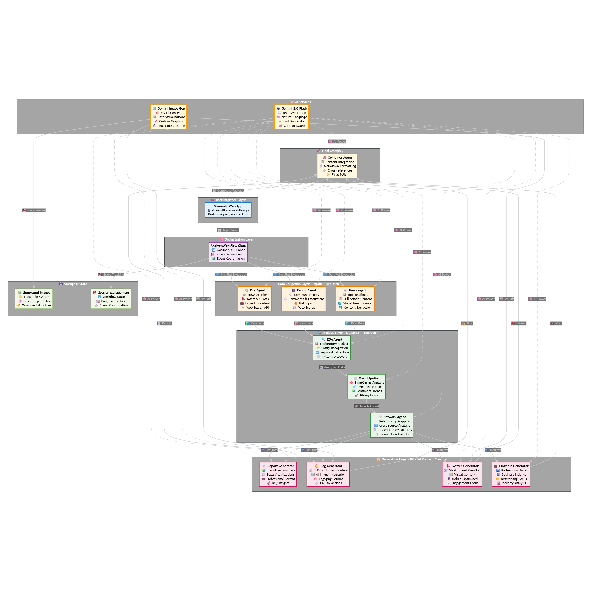
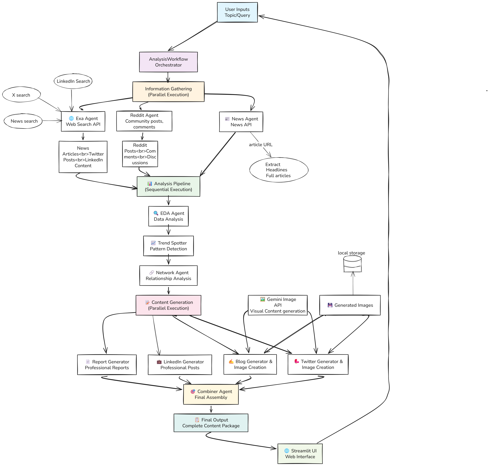

# AI Research & Content Generator

## What This Does

This project is an AI-powered tool that takes any topic, researches extensively across multiple sources and automatically creates:

- **Detailed research reports** with trend analysis
- **Social media posts** for LinkedIn, Twitter, and blog content
- **Visual content** using AI image generation

Built for the **Google ADK Hackathon 2025**, it uses Google's Agent Development Kit to coordinate multiple AI agents working together.

## How It Works

### 🔍 Step 1: Information Gathering

The system searches multiple sources in parallel:

- **Reddit** - Community discussions and opinions
- **News APIs** - Latest articles and headlines
- **Exa AI** - Web content, tweets, and LinkedIn posts

### 📊 Step 2: Smart Analysis

AI agents analyze the collected data to find:

- **Key trends** and patterns
- **Important relationships** between topics
- **Sentiment** and public opinion
- **Emerging themes** and insights

### 📝 Step 3: Content Creation

Generates multiple content formats:

- **Professional reports** with Key facts and points highlighted
- **Blog** with AI-generated images
- **LinkedIn posts** for business networking
- **Twitter threads** for viral engagement
-

## Key Features

- **Multi-Agent System** - Different AI agents handle specific tasks
- **Parallel Processing** - Faster results by running multiple searches at once
- **Visual Content** - Auto-generates relevant images using Gemini AI
- **Web Interface** - Easy-to-use Streamlit dashboard
- **Real-time Updates** - See progress as agents work

## Quick Start

1. **Install Requirements**

   ```bash
   pip install -r requirements.txt
   ```

2. **Set Up API Keys** (create `.env` file)

   ```
   GEMINI_API_KEY=your_key_here
   EXA_API_KEY=your_key_here
   NEWS_API_KEY=your_key_here
   REDDIT_CLIENT_ID=your_id_here
   REDDIT_CLIENT_SECRET=your_secret_here
   ```

3. **Run the App**

   ```bash
   streamlit run workflow/workflow.py
   ```

4. **Enter Any Topic** and watch the AI create comprehensive content!

## Example Topics

- **Tech Events**: "Google I/O 2025", "Apple WWDC 2025"
- **Industry Trends**: "AI Agent Development", "Future of VR"
- **Current Events**: Any trending topic you want to analyze

## Project Structure

```
├── agents/           # AI agents for different tasks
├── prompts/          # Instructions for each agent
├── workflow/         # Main application logic
├── generated_images/ # AI-created visuals
└── sample_result/    # Example output
```

## Architecture Diagrams

### System Architecture Overview



### End-to-End Workflow Flow



## Technology Stack

- **Google ADK** - Agent orchestration and management
- **Gemini AI** - Text generation and image creation
- **Streamlit** - Web interface
- **Multiple APIs** - Reddit, News, Exa for data sources

## What Makes This Special

This isn't just another content generator. It's a **smart research assistant** that:

- Thinks like a human researcher
- Gathers information from multiple angles
- Creates content for different audiences
- Provides visual elements to enhance understanding

Perfect for marketers, researchers, content creators, and anyone who needs comprehensive analysis of trending topics.
